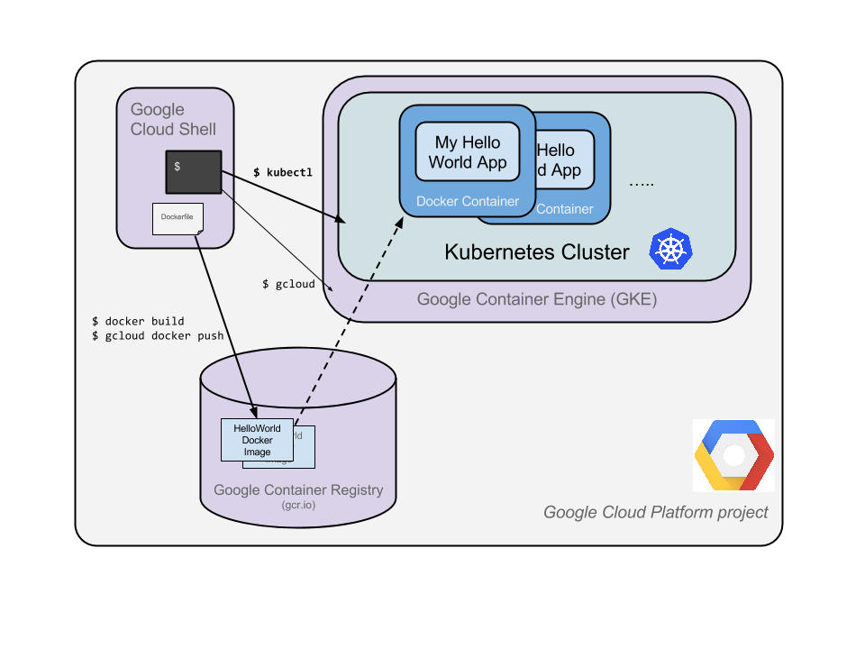
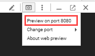
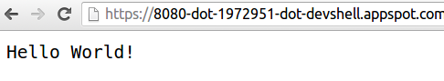
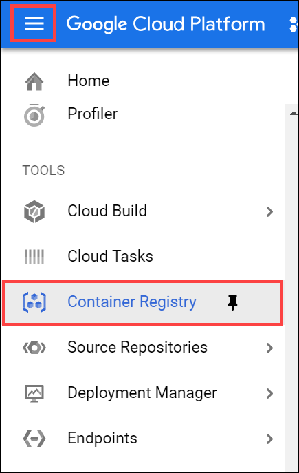
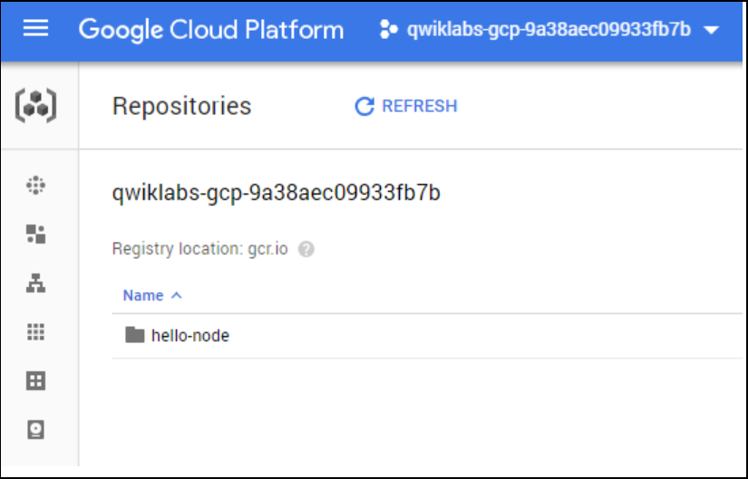
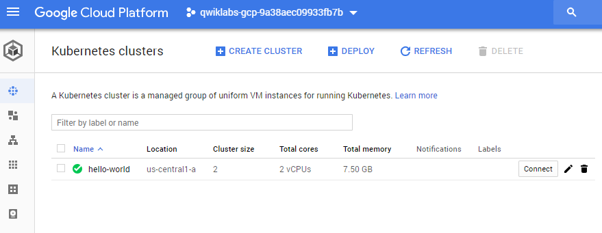
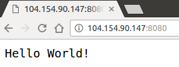
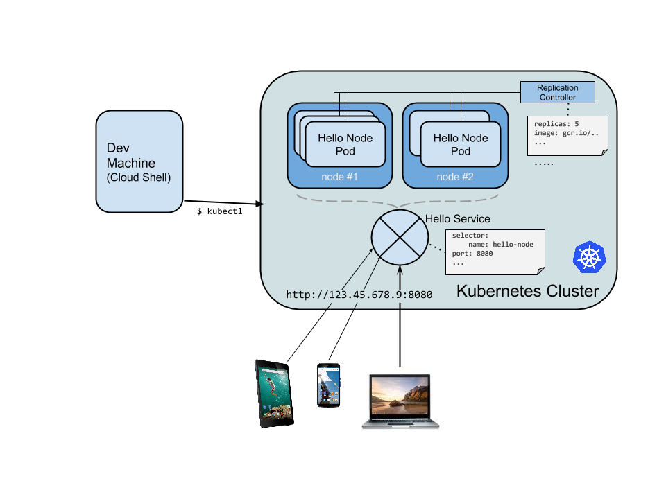

# Hello Node Kubernetes

## 개요

이번 실습의 목표는 당신이 개발한 코드를 쿠버네티스에서 실행되는 복제 애플리케이션으로 만드는 것입니다. 이 애플리케이션은 쿠버네티스 엔진에서 작동됩니다. 이번 실습에 쓰일 코드는 간단하게 Hello World를 출력하는 node.js 앱이 될 것입니다.

이번 실습에서 도움이 될만한 다이어그램이 아래에 있습니다. 이 정보를 실습을 통해 진행하면서 참조 자료로 사용하십시오.



쿠버네티스는 오픈 소스 프로젝트( kubernetes.io에서 이용 가능)로 노트북에서 부터 고가용성 멀티 노드 클러스터까지, 공공 클라우드부터 내부 배포까지, 가상 머신에서 베어메탈에 이르기까지 다양한 환경에서 실행할 수 있습니다. 

이번 실습의 목적은 쿠버네티스 엔진과 같은 관리 환경을 사용하는 것입니다. 이번 실습은 기반 인프라를 구축보단 Kubernetes 체험에 더 중점이 맞춰져 있습니다.

* 쿠버네티스 엔진 : (컴퓨팅 엔진에서 실행되는 Google 호스트 버전)

## 오늘 할 실습

- Node.js 서버 만들기
- Docker 컨테이너 이미지 만들기
- 컨테이너 클러스터 만들기
- 쿠버네티스 팟(pod) 만들기
- 서비스 스케일 업(scale-up) 하기

## 설정 (Setup)

- 1강과 동일, 생략

## Node.js 애플리케이션 만들기

클라우드 셸(Cloud Shell)을 사용하여,쿠버네티스 엔진에 배포할 간단한 Node.js 서버를 만들어 보세요:
```bash
$ vi server.js
```
편집 시작하기 : 
```bash
$ i
```
아래의 코드를 파일에 작성하세요:
```javascript
var http = require('http');
var handleRequest = function(request, response) {
    response.writeHead(200);
    response.end("Hello World!");
}
var www = http.createServer(handleRequest);
www.listen(8080);
```
`server.js` 파일 저장하기 : **ESC**를 누른 뒤 아래의 문구를 입력하세요 : 
```bash
:wq
```
Cloud Shell에 노드 실행 파일이 설치되어 있으므로 이 명령을 실행하여 노드 서버를 시작하십시오(명령은 출력을 생성하지 않음) :
```bash
$ node server.js
```
Cloud Shell 의 built-int Web preview feture 기능을 사용하여 새 브라우저 탭을 열어 확인해보자



새 브라우저 탭이 열리면서 결과를 볼 수 있습니다:



계속하기 전에 Cloud Shell로 돌아가 실행 중인 노드 서버를 중지하세요.(**Ctrl+c**를 입력) 이제 이 애플리케이션을 도커 컨테이너에 패키지할 것입니다.

## 도커 컨테이너 이미지 만들기

빌드 할 이미지를 설명하는 `Dockerfile` 을 만들어보자. Docker 컨테이너 이미지는 이미 존재하는 이미지에서 확장할 수 있다. 우리는 이미 존재하는 Node 이미지를 확장할 것이다.
```bash
$ vi Dockerfile
```
에디터 시작하기 :
```bash
i
```
아래 코드 작성하기:
```bash
FROM node:6.9.2
EXPOSE 8080
COPY server.js .
CMD node server.js
```
`Dockerfile` 을 차례대로 해석하자면 다음과 같다.
- `node` 라는 이미지를 Docker hub 로 부터 가져와 시작한다.
- `8080` 포트를 노출(expose)시키겠다
- `server.js` 파일을 복사한다
- 노드 서버를 시작한다

이 Docker 파일을 저장하기 위해 **Esc** 키를 눌러 다음을 입력하세요.
```
:wq
```
`PROJECT_ID`를 GCP 프로젝트 ID로 대체하여 이미지를 생성하십시오.
```bash
$ docker build -t gcr.io/PROJECT_ID/hello-node:v1 .
```
다운로드하고 추출하는 데는 시간이 좀 걸릴 것입니다. 하지만 이미지가 빌드 진행 상황을 확인 할 수 있습니다.

완료되면, 아래 명령어를 사용해 만든 이미지를 run 명령어를 실행하여 테스트해보자. run 명령어에서 사용된 옵션은 다음과 같다

- d: 데몬 모드라고 부르며 컨테이너가 백그라운드로 실행된다
- p: 호스트에 연결된 컨테이너의 특정 포트를 외부에 노출
```bash
$ docker run -d -p 8080:8080 gcr.io/PROJECT_ID/hello-node:v1
```
출력물은 다음과 같아야 합니다 :
```
325301e6b2bffd1d0049c621866831316d653c0b25a496d04ce0ec6854cb7998
```
결과를 보려면 Cloud Shell의 웹 미리 보기 기능을 사용하십시오.


아니면 Cloud Shell 프롬프트에서 `curl`을 사용해 확인 하실 수 있습니다.
```bash
$ curl http://localhost:8080
```
아래와 같이 출력이 되어야 합니다.
```bash
Hello World!
```
**Note**: Full documentation for the `docker run` command is [found here](https://docs.docker.com/engine/reference/run/).

다음으로 실행 중인 컨테이너를 중지할 것입니다.

다음을 실행하여 Docker 컨테이너 ID 찾으세요:
```bash
$ docker ps
```
다음과 같이 출력이 됩니다 : 
```bash
CONTAINER ID        IMAGE                              COMMAND
2c66d0efcbd4        gcr.io/PROJECT_ID/hello-node:v1    "/bin/sh -c 'node
```
이전 단계의 `Container ID`를 입력해 컨테이너를 중지하십시오:
```bash
docker stop [CONTAINER ID]
```
콘솔 출력은 아래와 같은 형식으로 나와야 합니다.(독자의 컨테이너 ID)
```bash
2c66d0efcbd4
```
현재 이 이미지는 의도대로 잘 작동하고 있습니다. 이 이미지를 구글 컨테이너 레지스트리에 푸시하세요. 구글 컨테이너 레지스트리는 구글 클라우드 프로젝트에서 접근 가능하며, 당신의 도커 이미지를 저장하는 private 저장소입니다.

아래의 커맨드를 실행하세요. `PROJECT_ID` 부분은 당신의 GCP Project ID를 입력하세요.
```
$ gcloud docker -- push gcr.io/PROJECT_ID/hello-node:v1
```
초기 푸시 작업을 완료하는 데 몇 분 정도 걸릴 수 있습니다. 빌드 진행상황을 아래와 같이 확인 할 수 있습니다.
```bash
The push refers to a repository [gcr.io/qwiklabs-gcp-6h281a111f098/hello-node]
ba6ca48af64e: Pushed
381c97ba7dc3: Pushed
604c78617f34: Pushed
fa18e5ffd316: Pushed
0a5e2b2ddeaa: Pushed
53c779688d06: Pushed
60a0858edcd5: Pushed
b6ca02dfe5e6: Pushed
v1: digest: sha256:8a9349a355c8e06a48a1e8906652b9259bba6d594097f115060acca8e3e941a2 size: 2002
```
컨테이너 이미지는 당신의 콘솔에 등록되어집니다. **Navigation menu > Container Registry** 로 이동하세요



이제 여러분은 Kubernetes가 접근하고 조정할 수 있는 프로젝트 전반의 Docker 이미지를 이용할 수 있게 되었습니다.



**Note**: A generic domain is used for the registry ([gcr.io](http://gcr.io/)). You can be more specific about which zone and bucket to use. Details are [documented here.](https://cloud.google.com/container-registry/docs/#pushing_to_the_registry)

## 클러스터 만들기

이제 Kubernete Engine cluster 를 만들 준비가 되었습니다. 클러스터는 Google 에서 호스팅하는 Kubernetes 마스터 API 서버와 일련의 worker nodes 로 구성됩니다. worker nodes 는 Compute Engine virtual machines(가상머신)입니다.

`gcloud`를 사용하여 프로젝트를 설정하십시오.
```bash
$ gcloud config set project PROJECT_ID
```
두개의 [n1-standard-1](https://cloud.google.com/compute/docs/machine-types) 노드로 클러스터를 생성하십시오(완료하는 데 몇 분 정도 소요됨).
```bash
$ gcloud container clusters create hello-world \
                --num-nodes 2 \
                --machine-type n1-standard-1 \
                --zone us-central1-a
```
콘솔 출력은 다음과 같습니다.
```
Creating cluster hello-world...done.
Created [https://container.googleapis.com/v1/projects/PROJECT_ID/zones/us-central1-a/clusters/hello-world].
kubeconfig entry generated for hello-world.
NAME         ZONE           MASTER_VERSION  MASTER_IP       MACHINE_TYPE   STATUS
hello-world  us-central1-a  1.5.7           146.148.46.124  n1-standard-1  RUNNING
```
**Note**: You can also create this cluster through the Console by opening the Navigation menu and selecting Kubernetes Engine > Kubernetes clusters > Create cluster.

**Note**: It is recommended to create the cluster in the same zone as the storage bucket used by the container registry (see previous step).

**Navigation menu > Kubernetes Engine**로 이동하면, 쿠버네티스 엔진이 제공하는 a fully-functioning Kubernetes cluster를 확인 하실 수 있습니다.



이제 컨테이너화된 애플리케이션을 쿠버네티스 클러스터에 배포할 시간입니다! 지금부터 `kubectl` 커맨드를 사용하게 될 것입니다. (`kubectl`은 이미 클라우드 셸 환경에 설치되어 있습니다.)

## Create your pod

쿠버네티스 **pod**는 서로 연관된 컨테이너들의 모임입니다. pod는 단일 또는 여러 개의 컨테이너를 가질 수 있습니다. 여기서 private container registry에 저장된 Node.js 이미지로 빌드 된 하나의 컨테이너를 사용하게 됩니다. 이는 `8080`포트를 통해 제공할 예정입니다.

`kubectl run` 명령으로 pod 생성하십시요(`PROJECT_ID` 주의) :
```bash
$ kubectl run hello-node \
    --image=gcr.io/PROJECT_ID/hello-node:v1 \
    --port=8080
```
아래와 같이 출력됩니다.
```
$ deployment "hello-node" created
```
**Deployment** object가 생성된걸 확인할 수 있습니다.

 pod 를 만들고 크기를 조정할 때 deployment 를 사용하는 것을 권장합니다. 여기서 deployment 는 `hello-node:v1` 이미지를 실행하는 single pod replica 를 관리합니다.

Deployment를 보려면 다음을 실행하십시오.:
```bash
$ kubectl get deployments
```
출력:
```
NAME         DESIRED   CURRENT   UP-TO-DATE   AVAILABLE   AGE
hello-node   1         1         1            1           2m
```
포드를 보려면 다음을 실행하십시오 : 
```bash
$ kubectl get pods
```
출력:
```
NAME                         READY     STATUS    RESTARTS   AGE
hello-node-714049816-ztzrb   1/1       Running   0          6m
```
`kubectl` 명령어에 대해 좀 더 자세히 알고 싶으면 [Overview of kubectl](https://kubernetes.io/docs/reference/kubectl/overview/) 문서를 참고하세요.

## Allow external traffic

기본적으로 pod는 클러스터 내의 내부 IP로만 액세스할 수 있다. Kubernetes 가상 네트워크 외부에서 접근하기 위해서는 pod를 Kubernetes **서비스**로 노출해야 한다.

아래의 커맨드를 이용해 expose 할 수 있다.
```bash
$ kubectl expose deployment hello-node --type="LoadBalancer"
```
* --type="LoadBalancer" flag : 이 플래그는 외부 접근을 가능하게 하기 위해 사용된다

출력:
```
service "hello-node" exposed
```
공개적으로 액세스할 수 있는 서비스의 IP 주소를 찾으려면 아래의 커맨드를 사용해 모든 클러스터 서비스를 나열 할 수 있다.
```bash
$ kubectl get services
```
출력:
```
NAME         CLUSTER-IP     EXTERNAL-IP      PORT(S)    AGE
hello-node   10.3.250.149   104.154.90.147   8080/TCP   1m
kubernetes   10.3.240.1     <none>           443/TCP    5m
```
There are 2 IP addresses listed for your hello-node service, both serving port `8080`. The `CLUSTER-IP` is the internal IP that is only visible inside your cloud virtual network; the EXTERNAL-IP is the external load-balanced IP.

새탭을 열어 http://<EXTERNAL_IP>:8080 로 접속하면 Hello World를 확인 할 수 있다.



## Scale up your service

Kubernetes가 제공하는 강력한 기능 중 하나는 애플리케이션을 쉽게 확장이 가능하다는 것입니다.

pod에 대한 복제본의 수를 관리하도록 복제 컨트롤러(replication controller)에 지시 할 수 있습니다.
```bash
$ kubectl scale deployment hello-node --replicas=4
```
출력:
```
deployment "hello-node" scaled
```
업데이트된 배포에 대한 정보를 요청할 수 있다:
```bash
$ kubectl get deployment
```
출력: 
```
NAME         DESIRED   CURRENT   UP-TO-DATE   AVAILABLE   AGE
hello-node   4         4         4            4           16m
```
모든 pod를 나열할 수도 있다 :
```
$ kubectl get pods
```
출력 :
```
NAME                         READY     STATUS    RESTARTS   AGE
hello-node-714049816-g4azy   1/1       Running   0          1m
hello-node-714049816-rk0u6   1/1       Running   0          1m
hello-node-714049816-sh812   1/1       Running   0          1m
hello-node-714049816-ztzrb   1/1       Running   0          16m
```
여기서 **Declarative approach**(**선언적 접근법**)이 사용되고 있다. 새 인스턴스를 시작하거나 중지하는 대신 항상 실행해야 하는 인스턴스 수를 선언한다. Kubernetes reconciliation loops 는 사용자가 요청한 것과 일치하는지 확인하고 필요하다면 상황에 따라 어떤 action 을 한다.

Kubernetes 클러스터의 상태를 요약한 다이어그램 :



## Roll out an upgrade to your service

배포한 앱에 디버깅과 추가 기능을 넣으려는 상황에서, 쿠버네티스는 사용에 영향을 주지 않고 새 버전으로 배포하는 것을 도와준다. 

먼저, 애플리케이션을 수정한다. `server.js` 편집:
```bash
$ vi server.js
```
```
i
```
그런 다음 response 메세지를 수정한다 :
```javascript
response.end("Hello Kubernetes World!");
```
저장:
```
:wq
```
이제 새로운 컨테이너 이미지를 레지스트리에 빌드하고 배포 할 수 있다.
```
$ docker build -t gcr.io/PROJECT_ID/hello-node:v2 .
$ gcloud docker -- push gcr.io/PROJECT_ID/hello-node:v2
```
Note: Building and pushing this updated image should be quicker caching is being taken advantage of.

Kubernetes는 원활하게 replication controller 를 새 버전의 application 으로 업데이트한다. 실행중인 컨테이너의 이미지 라벨(image label)을 변경하려면 기존 `hello-node deployment` 를 편집하고 `gcr.io/PROJECT_ID/hello-node:v1` 에서 `gcr.io/PROJECT_ID/hello-node:v2` 로 이미지를 변경해야한다.

그렇게 하기위해서는 `kubectl edit` 명령어를 사용해야한다. deployment 의 yaml 형식의 구성 파일의 내용이 전부다 나오는데 지금은 이 내용을 다 이해할 필요는 없다. 우리는 여기서 `spec.template.spec.containers.image` 필드만 수정하면 된다.

    kubectl edit deployment hello-node

    # Please edit the object below. Lines beginning with a '#' will be ignored,
    # and an empty file will abort the edit. If an error occurs while saving this file will be
    # reopened with the relevant failures.
    #
    apiVersion: extensions/v1beta1
    kind: Deployment
    metadata:
      annotations:
        deployment.kubernetes.io/revision: "1"
      creationTimestamp: 2016-03-24T17:55:28Z
      generation: 3
      labels:
        run: hello-node
      name: hello-node
      namespace: default
      resourceVersion: "151017"
      selfLink: /apis/extensions/v1beta1/namespaces/default/deployments/hello-node
      uid: 981fe302-f1e9-11e5-9a78-42010af00005
    spec:
      replicas: 4
      selector:
        matchLabels:
          run: hello-node
      strategy:
        rollingUpdate:
          maxSurge: 1
          maxUnavailable: 1
        type: RollingUpdate
      template:
        metadata:
          creationTimestamp: null
          labels:
            run: hello-node
        spec:
          containers:
          - image: gcr.io/PROJECT_ID/hello-node:v1 ## Update this line ##
            imagePullPolicy: IfNotPresent
            name: hello-node
            ports:
            - containerPort: 8080
              protocol: TCP
            resources: {}
            terminationMessagePath: /dev/termination-log
          dnsPolicy: ClusterFirst
          restartPolicy: Always
          securityContext: {}
          terminationGracePeriodSeconds: 30

저장 :
```
:wq
```
출력:
```
deployment "hello-node" edited
```
이전 pod는 제거되고 새로운 pod를 확인 할 수 있다.
```bash
$ kubectl get deployments
```
출력:
```
NAME         DESIRED   CURRENT   UP-TO-DATE   AVAILABLE   AGE
hello-node   4         4         4            4           1h
```
이 과정에서 사용자는 서비스 사용에 있어 어떠한 방해도 받지 않고 새로운 버전으로 배포가 가능하다.