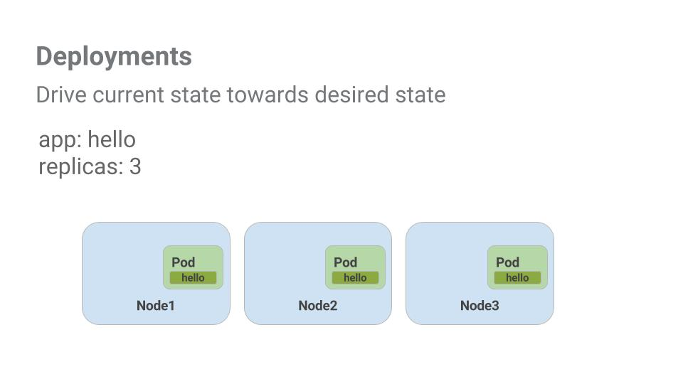

# Orchestrating the Cloud with Kubernetes
## Overview

이번 시간에는 다음 3가지를 배우게 된다.
- **Kubernetes Engine** 을 통해 Kubernetes cluster 를 프로비져닝하는 방법
- `kubectl` 명령어를 통해 도커 컨테이너를 관리하고 배포하는 방법
- Kuberentes's Depolyments 와 Services 를 사용하여 어플리케이션을 **microservices** 로 전환하는 방법

<blockquote>
Provisioning(프로비져닝)

IT 인프라 자원을 사용자 또는 비즈니스의 요구상항에 맞게 할당, 배치, 배포해서 시스템을 사용할 수 있도록 만들어 놓는 것.

</blockquote>

이번 실습에서는 "app"이라는 예제 애플리케이션을 사용한다. 

<blockquote>

[App](https://github.com/kelseyhightower/app) 은 Github 에서 호스팅되며 12-Factor 애플리케이션을 제공한다. 이번 실습에서 다음 Docker images 를 사용한다

* [kelseyhightower/monolith](https://hub.docker.com/r/kelseyhightower/monolith) : auth 및 hello service가 포함된 Monolith 
* [kelseyhightower/auth](https://hub.docker.com/r/kelseyhightower/auth) - Auth microservice. 인증된 사용자를 위해 JWT 토큰을 생성한다.
* [kelseyhightower/hello](https://hub.docker.com/r/kelseyhightower/hello) - Hello microservice. Greets authenticated users.
* [ngnix](https://hub.docker.com/_/nginx) - Frontend to the auth and hello services.

</blockquote>

쿠버네티스는 다양한 환경에서 실행될 수 있는 오픈 소스 프로젝트이다. 여기서 다양한 환경이라 함은 다음과 같다.
- from **laptops** to **high-availability multi-node clusters**
- from **public clouds** to **on-premise deployments**
- from **virtual machines** to **bare metal**  

이 실습은 쿠버네티스 엔진과 같은 managed environment 를 사용하여 기본 인프라를 설정하는 대신 쿠버네티스 경험에 집중할 수 있다.

## Google Kubernetes Engine
cloud shell 환경에서 다음 명령을 입력하여 zone 을 설정한다.

~~~ bash
$ gcloud config set compute/zone us-central1-b
~~~

zone 을 설정 한 후 이번 실습에서 사용할 클러스터를 생성한다

~~~ bash
$ gcloud container clusters create io
~~~

## Get the sample code

다음 명령어를 통해 Github 저장소를 clone 하고 clone 한 디렉토리로 이동하자

~~~ bash
$ git clone https://github.com/googlecodelabs/orchestrate-with-kubernetes.git
$ cd orchestrate-with-kubernetes/kubernetes
~~~

디렉토리 목록을 확인해보자

~~~ bash
$ ls
~~~

~~~ bash
deployments/  /* Deployment manifests */
  ...
nginx/        /* nginx config files */
  ...
pods/         /* Pod manifests */
  ...
services/     /* Services manifests */
  ...
tls/          /* TLS certificates */
  ...
cleanup.sh    /* Cleanup script */
~~~

## Quick Kuberentes Demo
`kubectl` 명령어를 사용하여 nginx 컨테이너의 단일 인스턴스를 시작해보자.

~~~ bash
$ kubectl run nginx --image=nginx:1.10.0
~~~

쿠버네티스를 통해 deployment 를 만들었다. -- deployment 에 대한 내용은 나중에 나온다. 하지만 deployments 를 실행하면 nodes 가 실패하더라도 pods 를 계속 실행한다는 것은 알고 있어야 한다. (but for now all you need to know is that deployments keep the pods up and running even when the nodes they run on fail.)

쿠버네티스에서는 모든 컨테이너가 pod 안에서 실행된다. 실행중인 nginx 컨테이너를 보려면 `kubectl get pods` 명령을 사용하면 된다.

~~~ bash
$ kubectl get pods
~~~

nginx 컨테이너가 실행되면 `kubectl expose` 명령을 사용하여 nginx 컨테이너를 쿠버네티스 외부에 노출시킬 수 있다. 

~~~ bash
$ kubectl expose deployment nginx --port 80 --type LoadBalancer
~~~

무슨 일이 일어난걸까? 
쿠버네티스는 공용 IP 주소가 첨부된 external Load Balancer(로드 벨런서) 를 생성했다. 공용 IP 주소에 도달 한 모든 클라이언트는 서비스 뒤에 있는 pod 로 라우팅된다. 이 경우에는 nginx pod 를 말한다.

`kubectl get services` 명령을 사용하여 우리 서비스를 확인해보자

~~~ bash
$ kubectl get services
~~~

<blockquote>
 
`ExternalIP` 필드가 서비스에 채워지기까지 시간이 걸릴 수 있다. 필드가 채워졌는지 `kubectl get services` 명령을 다시 실행하여 확인할 수 있다.

</blockquote>

`curl` 을 통해 nginx 컨테이너에 요청해보자 

~~~ bash
$ curl http://<External IP>:80
~~~

요청을 보내면 nginx 컨테이너에 잘 도달한다. 쿠버네티스는 `kubectl run` 및 `expose` 명령을 사용하여 즉시 사용 가능한 워크 플로우를 지원한다.

쿠버네티스에 대해 간단하게 둘러보았으니 쬐금만 더 깊게 알아보자. (무엇을? each of the components and abstractions)

## Pods
Pod 는 쿠버네티스의 핵심이라고 할 수 있다. 

Pods 는 하나 이상의 컨테이너를 가지고 있다. 서로에 대한 의존성이 강한 여러 컨테이너가 있는 경우 일반적으로 그 컨테이너들을 하나의 pod 에 둔다(package).

이 예제에서는 모놀리스 및 nginx 컨테이너가 포함된 pod 이다.

Pods 에는 **Volumes** 이 있다. Volume(볼륨) 은 pod 가 존재하는 한 계속 살아있는 **data disks** 이다. 해당 pod 의 컨테이너에서 사용할 수 있다. Pods 는 shared namespace for their contents 를 제공한다. 이 말은 즉, 예제 pod 안에 있는 두 컨테이너가 서로 통신 할 수 있으며 연결된 볼륨도 공유한다는 것을 의미한다.

뿐만 아니라, Pods 는 network namespaces 를 공유한다. 이는 pod 당 하나의 IP 주소가 있다는 것을 의미한다.

## Creating Pods
Pods 는 pod configuration files(구성 파일) 를 사용하여 만들 수 있다. monolith pod configuration file 을 살펴보고 따라해보자.

~~~ bash
$ cat pods/monolith.yaml
~~~

출력으로 구성 파일을 볼 수 있다.

~~~ bash
apiVersion: v1
kind: Pod
metadata:
  name: monolith
  labels:
    app: monolith
spec:
  containers:
    - name: monolith
      image: kelseyhightower/monolith:1.0.0
      args:
        - "-http=0.0.0.0:80"
        - "-health=0.0.0.0:81"
        - "-secret=secret"
      ports:
        - name: http
          containerPort: 80
        - name: health
          containerPort: 81
      resources:
        limits:
          cpu: 0.2
          memory: "10Mi"
~~~

여기서 주목해야 할 몇 가지 사항이 있다.
- 우리의 pod 는 하나의 컨테이너(monolith)으로 구성
- 시작할 때 컨테이너에 몇 가지 arguments 를 전달
- http 트래픽을 위해 80번 포트를 개방

`kubectl` 명령어를 사용하여 monolith pod 를 만들어보자

~~~ bash
$ kubectl create -f pods/monolith.yaml
~~~

우리의 pods 를 검사해보자. `kubectl get pods` 명령어를 통해 default namespace 에서 실행중인 모든 pods 의 목록을 확인할 수 있다.

~~~ bash
$ kubectl get pods
~~~

<blockquote>

monolith 컨테이너 이미지를 Docker hub 에서 가져와야 하기 때문에 monolith pod 가 작동하기까지 다소 시간이 걸릴 수 있다

</blockquote>

pod 가 실행되면 `kubectl describe` 명령어를 사용하여 monolith pod 에 대한 자세한 정보를 얻을 수 있다.

~~~ bash
$ kubectl describe pods monolith
~~~

pod IP 주소, 이벤트 로그 등 많은 정보를 볼 수 있으며 이는 어떤 문제가 발생했을 경우 유용하게 사용할 수 있을 것이다.

쿠버네티스는 pods 를 쉽게 생성 가능하다. 왜냐하면 구성 파일에서 구성 요소를 확인할 수 있고 실행 중이더라도 정보를 쉽게 볼 수 있기 때문이다. 이 시점에서 deployment 에 필요한 모든 pods 를 만들 수 있다! (Kubernetes makes it easy to create pods by describing them in configuration files and easy to view information about them when they are running. At this point you have the ability to create all the pods your deployment requires!)

## Interacting with Pods
기본적으로 pod 는 사설(private) IP 주소가 할당되며 클러스터 외부에 도달 할 수 없다. `kubectl port-forward` 명령을 사용하여 local port(로컬 포트)를 monolith pod 안의 포트에 매핑할 수 있다.

우선 2개의 cloud shell terminal 을 열고 하나는 `kubectl port-forward` 명령을 실행하고 다른 하나는 `curl` 명령을 실행할 것이다.

우선 **2nd terminal** 에서 port-forwarding 을 설정한다.

~~~ bash
$ kubectl port-forward monolith 10080:80
~~~

그리고 **1nd terminal** 에서 `curl` 명령을 사용한다.

~~~ bash
$ curl http://127.0.0.1:10080
~~~

응답이 잘 오는 것을 확인할 수 있다.
그럼 이제 `curl` 명령을 이용하여 `secure` endpoint(엔드포인트)로 요청했을 경우 어떻게 응답이 오는지 확인해보자.

~~~ bash
$ curl http://127.0.0.1:10080/secure
~~~

음...
monolith 에서 auth token(인증 토큰)을 받아보자.

~~~ bash
$ curl -u user http://127.0.0.1:10080/login
~~~

login prompt 에서 패스워드를 "password" 라고 입력하여 로그인하자. 

로그인하면 JWT token 이 출력된다. cloud shell 은 긴 문자열 복사를 제대로 처리하지 못해서 토큰에 대한 환경 변수(enviroment variable)를 만든다.

~~~ bash
$ TOKEN=$(curl http://127.0.0.1:10080/login -u user|jq -r '.token')
~~~

host 패스워드를 입력하라고하면 다시 "password" 를 입력하면 된다. 

이 명령을 사용하여 토큰을 복사한 다음 다시 `curl` 명령을 사용하여 `secure` 엔드포인트로 요청해보자.

~~~ bash
$ curl -H "Authorization: Bearer $TOKEN" http://127.0.0.1:10080/secure
~~~

응답이 오는 것을 확인할 수 있다. 

`kubectl logs` 명령을 사용하여 monolith pod 의 로그를 보자.

~~~ bash
$ kubectl logs monolith
~~~

**3rd terminal** 를 열고 `-f` 플래그를 사용하여 실시간으로 로그가 출력되는 것을 확인해보자.

~~~ bash
$ kubectl logs -f monolith
~~~

이제 **1rd termianl** 에서 `curl` 명령을 이용하여 monolith 와 interact(상호작용)하면 **3rd terminal** 에서 로그가 업데이트되는 것을 볼 수 있다.

~~~ bash
$ curl http://127.0.0.1:10080
~~~

`kutbectl exec` 명령을 사용하여 monolith pod 에 있는 interactive shell(대화형 쉘)을 이용해보자. 이는 컨테이너 내부에서 발생한 troubleshoot(문제)를 해결할 때 유용하다.

~~~ bash
$ kubectl exec monolith --stdin --tty -c monolith /bin/sh
~~~

예를 들어 monolith 컨테이너에 셸이 있으면 `ping` 명령을 사용하여 외부 연결을 테스트할 수 있다.

~~~ bash
# ping -c 3 google.com
~~~

interactive shell 사용이 끝났으면 `exit` 명령으로 로그아웃할 수 있다.

~~~ bash
# exit
~~~

pod 와 상호작용하는 것은 `kubectl` 명령을 사용하는 것만큼 쉽다. 컨테이너에 원격으로 접속을 하거나, login shell 을 사용해야하는 경우 등 우리가 필요한 많은 것들을 쿠버네티스에서 제공해준다.

## Services

Pods 는 persistent(영속성, 지속성) 하지 않다. failed liveness 또는 readiness checks 등 여러가지 이유로 중지될 수 있다. 

포드와 통신(communicate)하고 싶으면 어떻게 해야될까? 다시 시작되면 IP주소가 다를 수 있는데..

그래서 **Services** 가 필요하다. Services 는 pod 를 위해 안정적인 endpoints 를 제공해준다.

Services 는 라벨을 사용하여 그들이 작동하는 pods 를 결정한다. 만약 Pods 에 올바른 라벨이 있으면 자동으로 선택되어 노출된다. (Services use labels to determine what Pods they operate on. If Pods have the correct labels, they are automatically picked up and exposed by our services.)

서비스가 pod 에 제공하는 엑세스 수준은 Services 의 type 에 따라 다르다. 현재 3가지 type(유형) 이 있다.
- `ClusterIP` (internal) : default type 은 Service 가 내부에서만 볼 수 있음을 의미
- `NodePort` : 외부에서 클러스터의 각 노드에 접근할 수 있는 IP를 제공
- `LoadBalancer` : cloud provider 로부터 로브 벨런서를 추가하여 서비스의 트래픽을 노드로 전달

<blockquote>

- `ClusterIP` (internal) -- the default type means that this Service is only visible inside of the cluster,

- `NodePort` gives each node in the cluster an externally accessible IP and

- `LoadBalancer` adds a load balancer from the cloud provider which forwards traffic from the service to Nodes within it.

</blockquote>

이제 우리는 다음 2가지를 배울 것이다.
- Create a service
- 라벨 selectors 를 사용하여 일부 pods 를 외부에 노출

## Creating a Service
services 를 만들기 전에 먼제 http 트래픽을 처리할 수 있는 secure pod 를 만들어보자.

만약 디렉토리를 변경했다면 `~/orchestrate-with-kubernetes/kubernetes` 디렉토리로 돌아가자.

~~~ bash
$ cd ~/orchestrate-with-kubernetes/kubernetes
~~~

monolith servcie 구성 파일을 보도록 하자

~~~ bash
$ cat pods/secure-monolith.yaml
~~~

secure-monolith pods 와 configuration data(구성 데이터)를 생성하자.

~~~ bash
$ kubectl create secret generic tls-certs --from-file tls/
$ kubectl create configmap nginx-proxy-conf --from-file nginx/proxy.conf
$ kubectl create -f pods/secure-monolith.yaml
~~~

이제 secure pod 가 생성되었으므로 secure-monolith pod 를 외부에 노출(expose) 할 차례이다. 그렇게 하라면 쿠버네티스 service 를 만들어야한다. 

monolith servcie 구성 파일을 보도록하자.

~~~ bash
$ cat services/monolith.yaml
~~~

(Output):

~~~ bash
kind: Service
apiVersion: v1
metadata:
  name: "monolith"
spec:
  selector:
    app: "monolith"
    secure: "enabled"
  ports:
    - protocol: "TCP"
      port: 443
      targetPort: 443
      nodePort: 31000
  type: NodePort
~~~

주의사항:
1. selector 는 자동으로 `"app=monolith"` 및 `"secure=enabled` 라벨이 있는 모든 pods 를 찾고 노출시키는데 사용한다.
2. 외부 트래픽을 31000 포트에서 nginx(443 포트)로 전달하기 위해 nodeport를 노출시켜야한다.

 
monolith service 구성 파일에서 monolith service 를 생성하려면 `kubectl create` 명령을 사용하면 된다.

~~~ bash
$ kubectl create -f services/monolith.yaml
~~~

(Output):

~~~ bash
service "monolith" created 
~~~

포트를 사용하여 service 를 노출하고 있고 있다. 즉 다른 앱이 서버 중 하나의 31000포트에 바인딩하려고하면 포트 충돌이 발생할 수 있다. 일반적으로 쿠버네티스는 이 port assignment(포트 할당)을 헨들링한다. 이 실습에서는 나중에 health checks 하는 것을 더 쉽도록 구성하고 포트를 선택했다. 

`gcloud comput firewall-rules` 명령을 사용하여 노출된 nodeport 의 monolith service 에 대한 트레픽을 허용한다.

~~~ bash
$ gcloud compute firewall-rules create allow-monolith-nodeport \
  --allow=tcp:31000
~~~

모든 설정이 끝났으므로 port forwarding 을 사용하지 않고 클러스터 외부에서 secure-monolith service 에 접근 할 수 있어야한다

먼저 노드 중 하나에 대한 외부 IP 주소를 가져온다.

~~~ bash
$ gcloud compute instances list
~~~

`curl` 명령을 사용하여 secure-monolith service 에 요청을 해보자.

~~~ bash
$ curl -k https://<EXTERNAL_IP>:31000
~~~

Time out... 왜 이럴까?

<blockquote>

다음 질문에 답하려면 다음 명령어를 사용해야 한다.

`$ kubectl get services monolith`

`$ kubectl describe services monolith`

**Question**:
- 왜 monolith service 로 부터 응답을 얻을 수 없을까?
- monolith service 는 몇 개의 endpoints 를 가지고 있을까?
- monolith servcie 에 의해 pod 를 가져와야하는 라벨은 무엇일까? (What labels must a Pod have to be picked up by the monolith service?)

</blockquote>

다음 단계에서 이 문제를 해결할 것이다.

## Adding Labels to Pods
현재 monolith service 에는 endpoints 가 없다. 이와 같은 문제를 해결하는 한 가지 방법은 label query 와 함께 `kubectl get pods` 명령을 사용하는 것이다. 

monolith label 로 실행되는 pod 가 꽤 많이 있는 것을 알 수 있다.

~~~ bash
$ kubectl get pods -l "app=monolith"
~~~

그러나 `"app=monolith"` 와 `"secure=enabled"` 는 어떠한가? 

~~~ bash
$ kubectl get pods -l "app=monolith,secure=enabled"
~~~

이 label query 는 결과가 출력되지 않는다. `"secure=enabled"` 라벨을 추가해야 되는 것 같다.

`kubectl label` 명령을 사용하여 누락 된 `secure=enabled` 라벨을 secure-monolith pod 에 추가하자. 그런 다음 라벨이 업데이트되었는지 확인해보자.

~~~ bash
$ kubectl label pods secure-monolith 'secure=enabled'
$ kubectl get pods secure-monolith --show-labels
~~~

이제 우리 pod 에 올바르게 라벨이 지정되었으므로 monolith services 의 endpoints 목록을 보자.

~~~ bash
$ kubectl describe services monolith | grep Endpoints
~~~

우리 노드 중 하나를 다시 요청해보면서 테스트 해보자.

~~~ bash
$ gcloud compute instances list
$ curl -k https://<EXTERNAL_IP>:31000
~~~

## Deploying Applications with Kubernetes
이번 실습의 목적은 production(프로덕션) 환경에서 컨테이너를 확장 및 관리할 수 있도록 준비하는 것이다. 이제 **Deployments** 에 대해 알아 볼 차례이다. Deployments 는 실행중인 pod 갯수가 사용자가 지정한 pod 의 원하는 수와 동일한 지 확인하는 declarative way(선언적 방법)이다.

Deployments 의 주요 이점은 pod 관리에 대한 low level details (낮은 수준의 세부 사항)을 abstracting(추상화)하는 것이다. 배후에서 Deployments 는 Replica Sets 를 사용하여 pod 를 관리한다(starting and stopping). 만약 pod 를 업데이트하거나 scaled(확장)해야하는 경우 Deployemnt 가 이를 처리한다. Deployment 는 다양한 이유로 다운된 pod 를 다시 시작할 수 있도록 헨들링한다. 

다음 example 을 보도록 하자.

Pods 는 Node 가 생성 된 Node 의 lifetime 에 연결된다.(Pods are tied to the lifetime of the Node they are created on) 위 그림에서 Node3는 Pod 와 함께 down 되었다. 새 Pod를 수동으로 생성하고 Node를 찾는 대신 Deployment 는 새로운 Pod 를 생성하고 Node2에서 시작한다. 

Pod 및 Services 에 대해 배운 모든 것을 결합하여 Deployments 를 사용하여 monolith aplication 을 더 작은 서비스로 분해해야한다.

## Creating Deployments

우리는 monolith app 을 3개로 분해 할 것이다.

- **auth** : 인증 된 사용자들에게 JWT 토큰을 생성해준다
- **hello** : 인증 된 사용자에게 인사~ (Greet authenticated users.)
- **frontend** : 트래픽을 auth 및 hello 서비스로 라우팅한다

각 서비스마다 하나씩 deployment 를 만들 준비가되었다. 그런 다음, frontend deployment 를 위한 external service, auth 및 hello deployments 를 위한 internal service 를 정의한다. 완료되면 monolith 와 마찬가지로 **microservices** 와 상호작용할 수 있게 되며 이제는 각 조각을 개별적으로 확장 및 배포할 수 있게 된다!

auth deployment 구성 파일을 확인하고 시작해보자!

~~~ bash
$ cat deployments/auth.yaml
~~~

(Output):

~~~ bash
apiVersion: extensions/v1beta1
kind: Deployment
metadata:
  name: auth
spec:
  replicas: 1
  template:
    metadata:
      labels:
        app: auth
        track: stable
    spec:
      containers:
        - name: auth
          image: "kelseyhightower/auth:1.0.0"
          ports:
            - name: http
              containerPort: 80
            - name: health
              containerPort: 81
...
~~~

배포시 1개의 replica(복제본)이 생성되며 버전 1.0.0의 auth 컨테이너를 사용하고 있다.(The deployment is creating 1 replica, and we're using version 1.0.0 of the auth container.)

auth deployment 를 생성하기 위해 `kubectl create` 명령을 실행하면 Deployment manifest 의 데이터를 따르는 하나의 pod 가 만들어진다. 즉, Replicas field 에 지정된 번호를 변경하여 pod 의 수를 조정할 수 있다.

어쨌든, deployment object 를 생성해보자.

~~~ bash
$ kubectl create -f deployments/auth.yaml
~~~

이제 auth deployment 를 위한 service 를 만들 차례이다. `kubectl create` 명령을 사용하여 auth service 를 작성하자. 

~~~ bash
$ kubectl create -f services/auth.yaml
~~~

이제 hello deployment 를 만들고 노출시킬려면 위와 동일한 작업을 수행해야한다.

~~~ bash
$ kubectl create -f deployments/hello.yaml
$ kubectl create -f services/hello.yaml
~~~

frontend Deployment 를 만들고 노출시키자.

~~~ bash
$ kubectl create configmap nginx-frontend-conf --from-file=nginx/frontend.conf
$ kubectl create -f deployments/frontend.yaml
$ kubectl create -f services/frontend.yaml
~~~

<blockquote>
컨테이너에 일부 configuration data 를 저장해야하기 때문에 frontend 를 만드는 단계가 한 단계 더 있다.
</blockquote>

frontend 와 상호작용하여 외부 IP를 잡은 다음 `curl` 명령어를 이용하여 확인한다.

~~~ bash
$ kubectl get services frontend
$ curl -k https://<EXTERNAL-IP>
~~~

그리고 hello 응답을 돌려 받을 것이다!!
