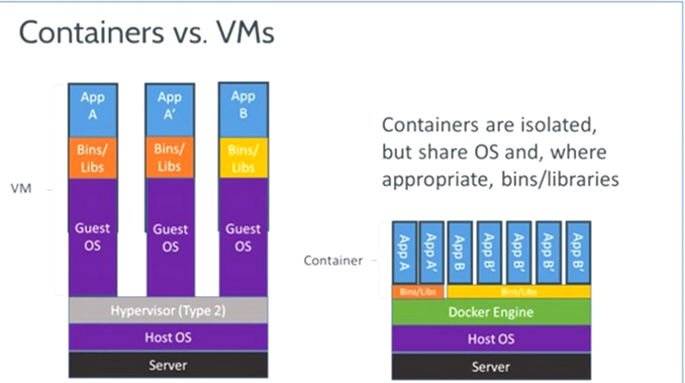
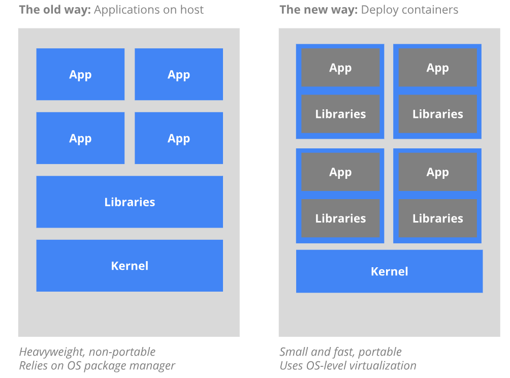

# 도커 기초

## 도커란?

- **각각의 애플리케이션**을 실행할 수 있도록 **독립된 환경**을 제공해주는 기술

- 다양한 기술을 한 대의 컴퓨터에서 개발하고 배포하는 컨테이너 기술

- 한대의 컴퓨터에서 여러 개의 서비스를 운영하고 싶은데, 그 서비스들 마다 각자 기술스택이 다를 수 있다. 그것 때문에 구성해야하는 환경도 다르고... 그렇다고 다 가상머신 위에서 운영하자니 속도도 느리고 무겁고... 이때 적절한 것이 도커.

- 어떤 서비스는 PYTHON 2 쓰고.. 어떤 서비스는 PYTHON 3쓰고.. 어떤건 노드.JS 쓰고...하 번거로워.. → 그래서 **각 애플리케이션**에 맞는 **각각의 독립된 환경**을 한대의 머신에서 실행하겠다!
<br><br><br>
## VM하고 도커 가장 큰 차이점은?

- 가상머신은 기본 OS(호스트 OS)위에 하이퍼바이저, 그리고 그 위에 여러개의 게스트 OS가 올라간다.

- 이에 비해 도커는 호스트 OS 위에 Docker 엔진이 있고, 그 위에서 각자 애플리케이션들이 독립된 환경에서 동작한다. → 그래서 빠름

- 즉, OS가 여러번 반복해서 생기는것이 아닌, 호스트OS에서 **'환경'** 만 제공하는 것! 애플리케이션 마다 별도의 OS를 사용하지 않는다.


<br><br><br>
## 이미지란?

- 각 OS를 실행 하기 위한 파일들을 모아둔 것으로 필요에 따라 os 이외에도 각종 서비스나 소스파일들이 포함되어 있는 **파일**이다. ( like 실행 파일 )

- 가상 머신을 생성 할 때 사용하는 iso파일과 비슷한 개념

- 컨테이너를 생성하고 실행할 때 읽기 전용으로 사용된다.
<br><br><br>
## 컨테이너란?

- 이미지가 **수행된 상태**가 컨테이너이다. ( like 프로세스 )

- 즉, **파일**형태로 있을 땐 이미지, **실행**이 되면 컨테이너이다.

- 컨테이너화 도식도

    

- 예를 들어, 웹 서버 도커 이미지로부터 여러 개의 컨테이너를 생성하면 생성된 컨테이너의 개수만큼 웹서버가 생성되고, 이 컨테이너들은 외부에 웹 서비스를 제공하는 데 사용되게 된다.

- 예를 들어, 우분투 도커 이미지로 두 개의 컨테이너를 생성한 뒤 A 컨테이너에 몽고DB를, B컨테이너에 MySQL을 설치해도 각 컨테이너는 서로 영향을 주지 않는 독립된 환경이란 뜻!

<br><br><br>
## 도커 허브

- 잘 세팅된 이미지들이 공유되어 있는 저장소

- 잘 만들어진 코드들이 모여있는 깃허브와 같은 맥락.

<br><br><br>
## 윈도우에서 도커가 가능한가?

- pro 에디션 부터 사용 가능

    ex ) 윈도우에 우분투를 올려서 리눅스 명령어를 써보고 싶어... → 도커로 가능!

<br><br><br>
## 기본 도커 명령어( 계속 업데이트 )

- 컨테이너 생성 명령어 : `docker run`
    ```bash
    $ docker run hello-world // 컨테이너를 생성하고 실행한다.
    ```
- hello-world라는 컨테이너가 있으면 바로 실행하고 없으면 도커 허브에서 자동으로 이미지를 내려받아 컨테이너를 생성 및 실행한다!
- run 명령어에 포함된 과정 : `docker pull(이미지 없을 시)` → `docker create` → `docker start`

<br>

- 컨테이너 실행 중지 명령어 : `docker stop`
    ```bash
    $ docker stop <컨테이너 이름> // 이미지이름 아니에요.. 컨테이너 이름!
    ```
<br>

- 내려받은 이미지들 확인 명령어: `docker images`
    ```bash
    $ docker images 
    ```
<br>

- 실행중인 컨테이너 확인 명령어 : `docker ps`
    ```bash
    $ docker ps 
    $ docker ps -a // -a 옵션을 붙여주면 실행이 완료된 컨테이너도 함께 출력된다.
    ```
<br>

- 컨테이너 내부로 들어가는 명령어 : `docker attach <컨테이너 이름>`
    ```bash
    $ docker attach <컨테이너 이름>
    ```
<br>

- 컨테이너 삭제 명령어 : `docker rm <컨테이너 이름>`
    ```bash
    $ docker rm <컨테이너 이름> 
    $ docker rm -f <컨테이너 이름> // -f 옵션을 붙여주면 실행중인 컨테이너를 삭제 할 수 있다.
    ```
- 실행중인 컨테이너는 삭제가 불가능하다.  하지만 -f 옵션을 붙여주면 삭제가 가능하다.

REFERENCE :
[https://www.youtube.com/watch?v=gQG_FX9hlMg](https://www.youtube.com/watch?v=gQG_FX9hlMg)